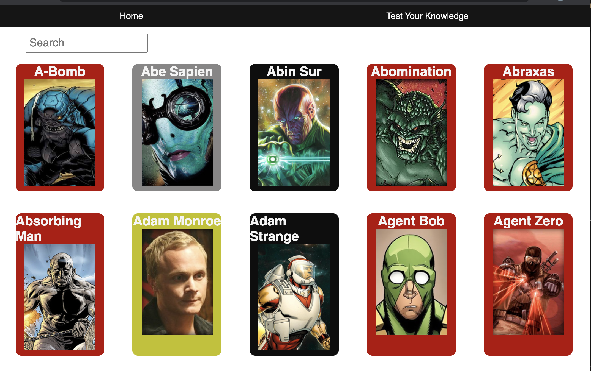
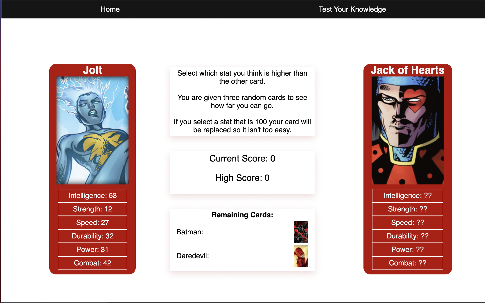

# Project 2: Superhero Toptrumps
## Timeframe : *48 hours*
### Goal: 
Build a React application that consumes a public API

## Technologies Applied:

- HTML5
- CSS3
- React
- Git
- GitHub
- Google Fonts
- Animate.css library

## Overview:
This was my second project at General Assembly, given 48 hours to build a front end React application. As a pair we decided to go for a superhero application, motivated by the top trumps game. Our application lists out all the superheros and an user can search by one and then view the details/stats of a particular superhero. 

Our Deployed version : https://our-project-work-ga.netlify.app/



### Controls
- At the Home page you can search using the filter bar, a particular super hero. Clicking a card takes you to the details page of the superhero, Clicking the card views all the stats.

- The second section called 'Test your Knowledge' is a game for the user to play 3 rounds with the computer. A random card is generated with the stats hidden. The user is also given a card with multiple fields to choose from such as strength, speed. Once chosen, that stat is compared with the computer computers field. If the users is greater then the computers then you score a point! (as shown below)




### Day One:
* Pseudocoding and Sign off with steps:
- Create Navbar Component which has links to home page and test your knowledge components.
```
function Nav() {
  return (
    <nav>
      <div className='navbar'>
        <Link to='/' className='link'>Home</Link>
        <Link to='/game' className='link'>Test Your Knowledge</Link>

      </div>
    </nav>
  )
}
```

- Working on DisplayAllSuper Component to firstly display all superheros from the external API : 
```
 React.useEffect(() => {
    const getData = async () => {
      try {
        const { data } = await axios.get('https://akabab.github.io/superhero-api/api/all.json')
        setSuperheros(data)
      } catch (err) {
        console.log(err)
      }
    }
    setTimeout(getData, 1000)
  }, [])

```

followed by rendering each card for each superhero using a map:
```
<div className='all-cards'>
          {superheros ? (
            filterSearch(superheros, search).map(superhero => {
              return <SuperHeroCard key={superhero.id} name={superhero.name} image={superhero.images.sm} publisher={superhero.biography.publisher} id={superhero.id} />
            })
          ) : (
            <Spinner />
          )}
        </div>
```


- Creating SuperheroShow Component for individual superheros, using CSS to  flip the Superhero card to view the stats.

- Finally made a start on the  Test Your Knowledge Component in the evening

### Day Two:
- On this day we focused on adding a Spinner Class using the React Spinner Class library :
```
function Spinner() {
  return (
    <div className="Loading">
      <Loader type="TailSpin" color="#ffd539" height="100" width="100" timeout={3000}/>
    </div>
  )
}
```
Then we moved onto brushing up on styling, adding box shadows on the score section on the Test your knowledge component

### Wins
- Worked well together to manage tasks, achieving targets as were given short timeframe
- Managed to successfully meet MVP on day 1 and brushed up on styling on day 2
- Solidifying React knowledge to Links in Navbar, Component rendering along with React Hook implementation of useState and useState and consuming an external API

### Challenges
- The biggest challenge for me for definately to implement the card flip animation to successfully show a superheros details stats
- Making the card responsive on the details page with CSS flex was also a challenge but helped me become proficient in CSS Flex implementation

### Learnings
- Achieving MVP under 48 hours - This was the first project ever where we had to achieve MVP in literally a day, so learning how to break down the project, get sign off and jumping into coding was a different experience from the first project but a great way to learn to deal with pressure under a stricter deadline.
- Solidifying React knowledge to add Links in Navbar, Component rendering along with React Hook implementation of useState and useState and consuming an external API


### Features to Implement 
- Making the website responsive for mobiles.
- Adding more animations to provide a better user experience

